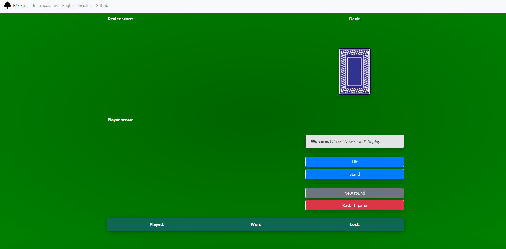

# Blackjack-js

## How to play

### Basics

1. This version of Blackjack is played with 6 decks and does not permit betting
1. Aces count as 1 or 11 points (whichever is better), 2-9 count according to their value and 10s and face cards each count 10 points
1. Each hand is valued as the sum of individual cards with the exception of a Blackjack (an ace and any 10-point card)
   - An ace and any 10-point card is ranked higher than any other hands achieving 21 points
1. The objective of the game is to win as many rounds as possible by beating the dealer
1. A round is won by having a total hand value close or at 21 without exceeding 21 **and** beating the dealer's hand value

### How a round is played

1. Empezar una nueva ronda pulsando: 'New round'.
1. El dealer (la casa) revela una carta para el y otras dos en la mano del jugador.
1. Puedes elegir entre dos opciones para continuar la ronda:
   - Hit: El dealer te da una carta más, aumentando el valor de tu mano. Puedes seguir
     pidiendo más cartas hasta que eligas plantarte (stand) o tu mano supere el valor de 21, en cuyo
     caso habrás perdido.
   - Stand: Decides plantarte con la mano que tienes y el dealer no te repartira más cartas, y
     el dealer comenzará su turno (hasta llegar a una puntación entre 17 y 21 el dealer seguirá
     añadiendo cartas a su mano).
1. Una vez todas las cartas esten repartidas se decidirá el ganador de la ronda.
1. Tú ganas si:
   - El valor de tu mano no excede 21 y el dealer si excede 21.
   - Tu mano no excede 21 y tiene un valor mayor a la mano del dealer.
